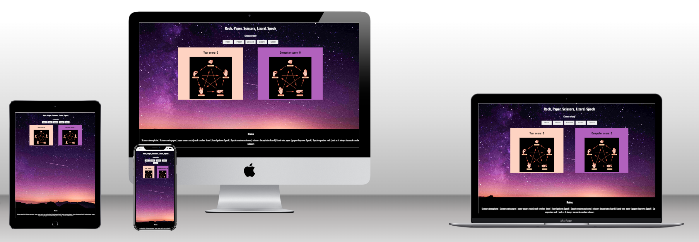
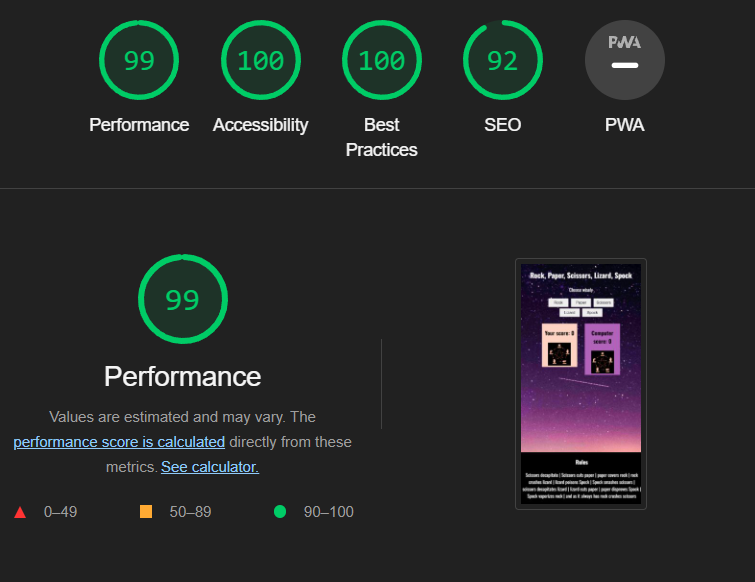
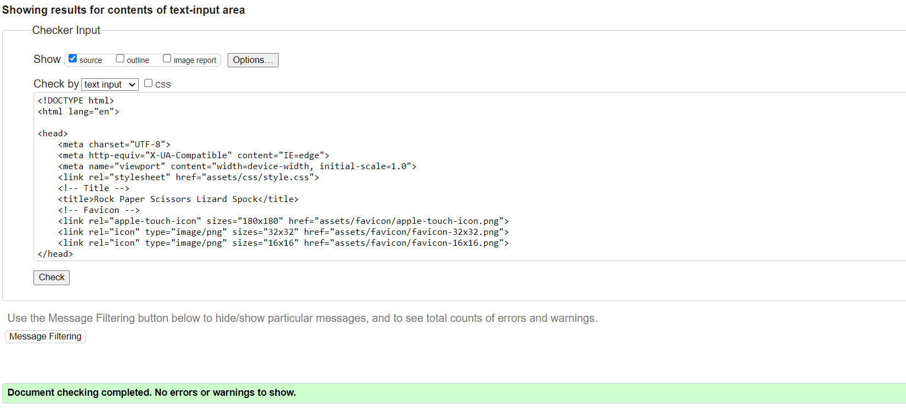
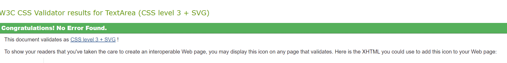

# Rock Paper Scissors Lizard Spock

This project was built to play the game Rock, Paper, Scissors, Lizard, Spock. It is a simply game with the winner the best out of five.

## Contents Table

- [UX](#ux 'UX')
    - [Purpose of site](#purpose-of-site 'Purpose of site')
    - [Site Goal](#site-goal "Site Goal")
    - [Audience](#audience "Audience")
- [Design](#design "Design")
    - [Colors used](#colors-used "Colors used")
    - [Fonts](#fonts "Fonts")
    - [Images](#images "Images")
- [Features](#features "Features")
- [Testing](#testing "Testing")
- [Technologies](#technologies "Technologies")
    - [Main languages](#main-languages "Main languages")
    - [Programs and libraries used](#programs-and-libraries-used "Programs and libraries used")
- [Deployment](#deployment "Deployment")
- [Credits](#credits "Credits")

## UX

### Purpose of site

The purpose of the site was for people who enjoyed the idea of a Star Trek version of the famouse rock, paper, scissors game. This game allows for them to do that.

### Site goal

The site goal is to make more people fans of Star Trek. Or for people who already are fans , for them to have a bit of fun.

### Audience

The audience is for all ages. The game is for anybody that wants to have a fun way of playing rock, paper, scissors.

## Design

### Colors used

the site used the four colors of :

#FFFFFF - clear white , this was used for text.
#FEBFA6 - cream/beige , this was used for the player.
#512558 - purple , this was used for the computer.
#180B24 - dark purple , this was anothor color used in the background image.

### Fonts

- 'Oswald' was primarily used.
-'sans-serif' was used

### Images

The game images was taken from a google search that I felt suited the color I wanted. The individual images are taken from the main image.

There was also a background images used from unsplash.

All the images are to create a space theme.

## Features

- Player choices : There are five player choices to make in this game.
- Computer choices : The computer will choose at random.
- Choices compared : When the player and computer has chosen , the results are compared to see who the winner is.
- Best out of five : After the player has chosen in several plays , which is best of five , the game is decided with a message appearing if the player has won or lost.
- End game : the game is restarted with both players on 0 again ready to play again. The message appears in a model that will either reload the page or bring you to google search.

## Testing

- The page has a great rating in lighthouse 

- The page has no errors in html validator.

- The css passes the validator.

- Only warnings show in jshint but code works perfectly.

## Technologies

### Main languages

- HTML
- CSS
- Javascript

### Programs and libraries used

- Google fonts 
- Google Images
- Font awesome
- Github 
- codeanywhere
- coolors
- unsplash

## Deployment

The site was deployed to github pages. The steps to deploy are :

- Use terminal to git add .
- Git commit the message that I want to show.
- And push the commit to GitHub pages.
- In github repository , navigate to the settings tab.
- From the source section drop-down menu , select main branch.
- Once the main branch has been selected , the page will automatically refresh with detailed ribbon display to indicate successful deployment.

## Credits

- I took inspiration from the rock, paper, scissors game that was showed to use as an example to use. I made chages to the function and overall style so to make a rock, paper, scissors, lizard, spock game.
- I took inspiration from w3schools for the modal.
- The rules of the game I took from the game image I used.
- I would also like to thank my mentor Spencer.